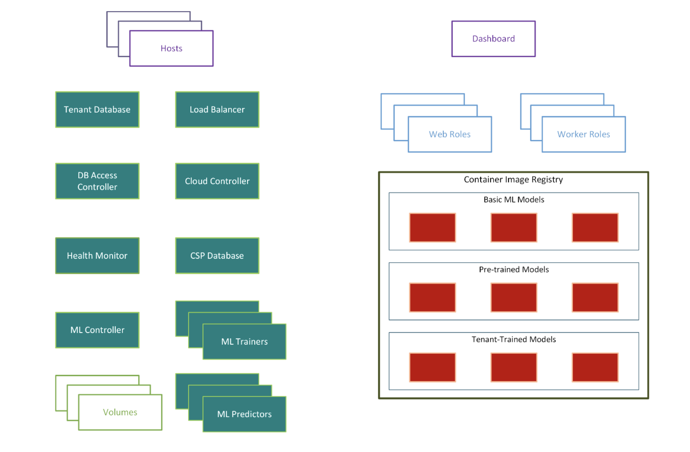
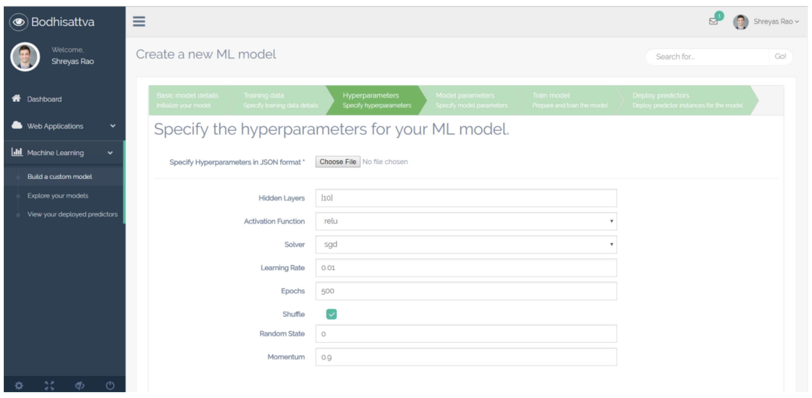
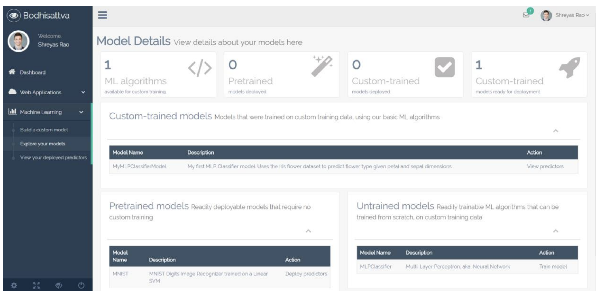
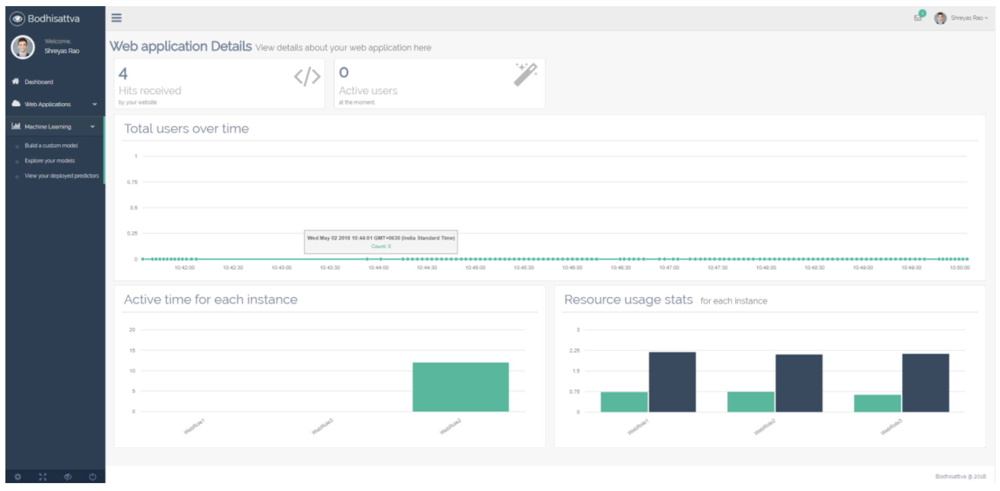

Bodhisattva – Rapid Deployment of AI on Containers

April 2018

# Introduction
Bodhisattva is a MLaaS (Machine Learning-as-a- Service) that provides a platform for deploying the Machine Learning Models provided as a service. The Machine Learning models can be pre-trained, tenant-trained or untrained models. Certain ML models such as Multi-Layer Perceptron, Support Vector Machines are provided as Untrained models to the tenants that can be deployed in a few clicks. The software also provides pre-trained models such as MNIST – Hand-written digits’ recognition, Speech Recognition and Image Recognition. These can be deployed and readily used for making predictions. Bodhisattva provides visualizations for the models depending on their limitations. This is a service that helps the user to fully understand the working of the ML models and their processes. It is aimed at incorporating ML to new as well as existing business solutions. It provides Custom-trained models to be deployed with the user’s data as a URL which is a useful feature for the user to understand the working of an ML model. The Tenant communicates through the Dashboard – which is a provided GUI that will be a seamless way for the Tenants to train, test and deploy ML models on the cloud without hassle.

# Architecture Diagram

# Description
## Hosts
Host operates on the public IP, and is internet-facing. It is responsible for relaying messages between the end-user and the other components. Each Tenant’s Web Application is hosted on a different Host instance (with a different IP).

## Dashboard
The Dashboard component serves the Tenant and Developer dashboards. All components can be monitored from here. Various statistics about the each of the components are represented using  graphical visualizations. The Tenant can monitor web roles and worker roles, create new web roles and worker roles, and be notified of any errors. The developer can access the log files of all components to fix errors, if any.

## MLController
The MLController is responsible for coordinating the ML related tasks such as MLTrainer creation, MLPredictor creation and the model trainings, with the other components and the tenant

## Load Balancer
This component keeps track of the load distribution among web roles and worker roles, and ensures that it is uniform. Other components may request the Load Balancer for an available web role or a worker role. The Load Balancer then chooses a suitable web role / worker role and returns the IP address. It is also expected to consider affinities between End-Users and Web Roles while load balancing. Automated dynamic creation of web roles and worker roles based on the requirement can be implemented as an additional feature.

## Database Access Controller
The DAC is responsible for cleaning, and parsing the database queries sent by the web roles and worker roles, and convert them in accordance to the multi-tenancy rules. Neither the web roles nor the worker roles are allowed direct access to the database. All other components can access the database directly.

## Database
This component houses a MySQL database, which is used to store the tenant data as well as other metadata necessary for the functioning of Bodhisattva.

## Health Monitor
This module ensures that all other components are active and are functioning as expected. It polls each component at regular intervals, and notifies the Dashboard of their health. In the event of a failure, a failover mechanism kicks in.

## Web Roles
The Web Role serves the frontend of the Tenant’s application to the End User. It currently supports tenant applications that have a web interface. Typically, all foreground operations are managed by the Web Role. These include serving webpages, receiving files from the End-User, updating the database, and offloading further processing to worker roles. In contrast to worker roles, a web role is usually active only till the End-User is active.

## Worker Roles
Worker Roles are responsible for background tasks which do not require End-User interaction. Worker roles can be used to supplement web roles - the web role can handover a task to the worker role and be ready to receive new incoming connections rather than being preoccupied with backend tasks. Worker Roles can also be used to perform persistent maintenance tasks, apart from the tasks assigned by web roles.

## MLTrainer
MLTrainer is responsible for carrying out the training of the ML model, in accordance with the deployment template provided by the tenant. It is created and started by the MLController, and it fetches the data for the training from the tenant’s volume. After training is complete the model object is serialized and stored, to be used in future. The training progress and the system resource usage is streamed back to the Dashboard.

## MLPredictor
MLPredictor takes the user’s prediction data and runs the serialized ML module’s predictor over them, to get the predictions. These are then returned to the service which called it – web role or worker roles. The entire process is co-ordinated by the MLController

## Snapshots

